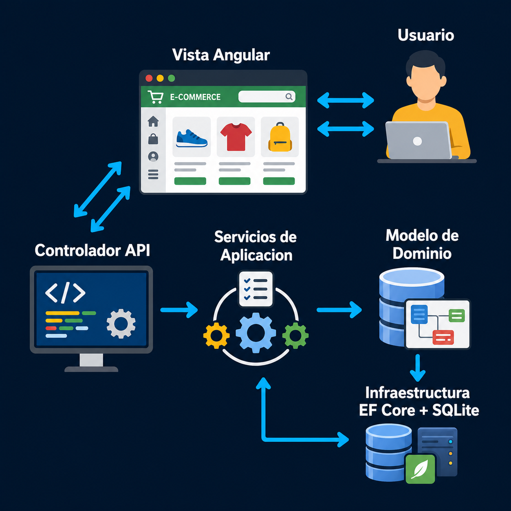

# Arquitectura

## Diagrama visual



## Decision principal

El proyecto usara ASP.NET Core Web API con controllers estilo MVC, pero la logica de negocio no vivira en los controllers.

Los controllers recibiran requests HTTP, validaran autorizacion basica del endpoint y delegaran el caso de uso a servicios de aplicacion.

## Estructura backend esperada

```text
backend/
  Ecommerce.sln
  src/
    Ecommerce.API/
    Ecommerce.Application/
    Ecommerce.Domain/
    Ecommerce.Infrastructure/
  tests/
    Ecommerce.Tests/
```

## Responsabilidades por capa

### Domain

Contiene las reglas centrales del negocio:

- Entidades.
- Enums.
- Value Objects si realmente son necesarios.

No debe depender de Entity Framework Core, ASP.NET Core ni librerias externas de infraestructura.

### Application

Contiene los casos de uso del sistema:

- DTOs.
- Interfaces.
- Servicios de aplicacion.
- Validaciones de entrada.

Para el MVP se usara una estructura simple con servicios de aplicacion, por ejemplo:

```text
Application/
  Services/
    AuthService
    ProductService
    CartService
    OrderService
```

Esto evita implementar CQRS completo antes de necesitarlo.

### Infrastructure

Contiene los detalles tecnicos:

- Entity Framework Core.
- SQLite.
- Repositories.
- Seed data.
- Implementaciones concretas de proveedores externos.

### API

Contiene la entrada HTTP:

- Controllers.
- Configuracion JWT.
- Swagger.
- Middlewares.
- Dependency Injection.

## Decisiones para el MVP

### API con controllers y servicios de aplicacion

Se usaran controllers porque ASP.NET Core los soporta naturalmente y son faciles de exponer en una prueba tecnica.

La logica no se escribira directamente en controllers. El controller debe delegar en servicios de aplicacion para mantener separacion de responsabilidades.

### No usar CQRS completo en Fase 1

CQRS significa separar comandos de escritura y consultas de lectura en modelos distintos.

Para este MVP puede agregar demasiada estructura inicial. La decision es mantener servicios de aplicacion simples y evolucionar si el sistema crece.

### SQLite desacoplado

SQLite se usara por simplicidad local. La logica de negocio no debe depender directamente de SQLite ni de Entity Framework Core.

Se usaran interfaces como repositorios para que Application dependa de contratos y no de implementaciones.

### Pagos por interfaz

Aunque el MVP solo tiene pago contra entrega, se definira un contrato como:

```csharp
public interface IPaymentProvider
{
    Task<PaymentResult> ProcessAsync(PaymentRequest request);
}
```

La primera implementacion sera `CashOnDeliveryProvider`. Esto permite agregar Stripe, PayPal u otro proveedor sin modificar el flujo principal de ordenes.

## Glosario para exposicion

- MVC: Model View Controller. En una API moderna de ASP.NET Core normalmente usamos controllers para recibir HTTP, pero no usamos vistas del servidor.
- API: Application Programming Interface. Es la entrada que permite que frontend y backend se comuniquen.
- DTO: Data Transfer Object. Objeto usado para transportar datos entre capas o por HTTP.
- ORM: Object Relational Mapper. Herramienta que permite trabajar tablas de base de datos como objetos de C#.
- EF Core: Entity Framework Core. ORM oficial de Microsoft para .NET.
- JWT: JSON Web Token. Formato de token usado para autenticar requests.
- CQRS: Command Query Responsibility Segregation. Patron que separa escrituras y lecturas.
- SOLID: Conjunto de principios para disenar codigo mantenible.
- DIP: Dependency Inversion Principle. Principio que indica que el codigo importante debe depender de abstracciones, no de implementaciones concretas.

