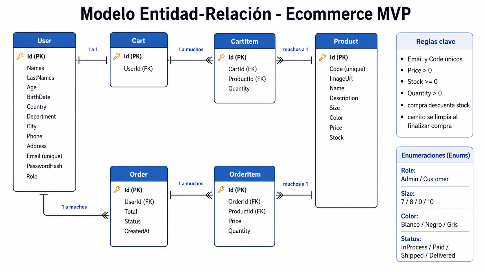

# Modelo Entidad Relacion

## Diagrama visual



## Entidades

### User

```text
Id
Names
LastNames
Age
BirthDate
Country
Department
City
Phone
Address
Email
PasswordHash
Role
```

Reglas iniciales:

- `Email` debe ser unico.
- `PasswordHash` nunca debe exponer la contrasena original.
- `Role` puede ser `Admin` o `Customer`.

### Product

```text
Id
Code
ImageUrl
Name
Description
Size
Color
Price
Stock
```

Reglas iniciales:

- `Code` debe ser unico.
- `Price` debe ser mayor que cero.
- `Stock` no debe ser negativo.
- `Size` solo permite 7, 8, 9 y 10.
- `Color` solo permite blanco, negro y gris.

### Cart

```text
Id
UserId
```

Reglas iniciales:

- Un carrito pertenece a un usuario.
- El carrito se persiste en backend.

### CartItem

```text
Id
CartId
ProductId
Quantity
```

Reglas iniciales:

- `Quantity` debe ser mayor que cero.
- No se debe permitir agregar cantidad mayor al stock disponible.

### Order

```text
Id
UserId
Total
Status
CreatedAt
```

Reglas iniciales:

- Una orden pertenece a un usuario.
- `Total` se calcula desde los items.
- `Status` inicia en `InProcess`.

### OrderItem

```text
Id
OrderId
ProductId
Price
Quantity
```

Reglas iniciales:

- `Price` guarda el precio al momento de la compra.
- Esto evita que cambios futuros de precio alteren historicos.

## Relaciones

```text
User 1 --- 1 Cart
Cart 1 --- N CartItem
Product 1 --- N CartItem

User 1 --- N Order
Order 1 --- N OrderItem
Product 1 --- N OrderItem
```

## Enums

```csharp
public enum UserRole
{
    Admin,
    Customer
}

public enum ProductSize
{
    Seven = 7,
    Eight = 8,
    Nine = 9,
    Ten = 10
}

public enum ProductColor
{
    White,
    Black,
    Gray
}

public enum OrderStatus
{
    InProcess,
    Paid,
    Shipped,
    Delivered
}
```

## Reglas de consistencia

- La compra debe descontar stock.
- No se debe crear una orden si no hay stock suficiente.
- El carrito debe limpiarse despues de finalizar compra correctamente.
- Las eliminaciones administrativas deben cuidar relaciones con ordenes historicas.

